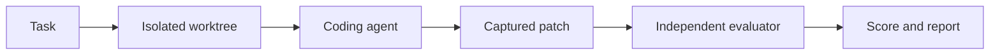

# AgentForge

[](https://github.com/GuerraXe/agentforge/actions/workflows/ci.yml)
[](LICENSE)

AgentForge is a command-line tool that gives a coding agent a task, runs it in an isolated Git
worktree, and independently judges whether the resulting patch actually worked — instead of
trusting the agent's own account of what it did. Point it at a task and a git repository; it
measures what actually changed against a deterministic test oracle and produces a transparent,
recomputable score. No server, no web UI, no dashboard — a binary and on-disk JSON/TOML.

Coding agents are good enough now that the interesting question has shifted from "can it write
code" to "did it, this time, on this task, without me watching it happen." Running an agent
directly against your working checkout answers none of that safely: you can't easily undo what it
did, you have no independent record of what actually ran, and "it says the tests pass" is the
agent's own unverified claim. AgentForge exists to close that gap.



*Task → Isolated worktree → Coding agent → Captured patch → Independent evaluator → Score and report*

## Install

**Prerequisites:** a recent stable Rust toolchain (2021 edition — install via
[rustup](https://rustup.rs) if you don't have one) and `git`. Nothing else — no database, no
Docker, no separate runtime to stand up.

AgentForge isn't published to crates.io (`publish = false` — see
[Security and limitations](#security-and-limitations)); the only way to get it today is building
from source, which takes under a minute:

```
git clone https://github.com/GuerraXe/agentforge.git
cd agentforge
cargo build --release          # binary lands at target/release/agentforge (.exe on Windows)
```

```
# Linux / macOS
./target/release/agentforge --help

# Windows (PowerShell)
.\target\release\agentforge.exe --help
```

Optional — put the binary on your `PATH` so plain `agentforge ...` works from anywhere:

```
# Linux / macOS
cp target/release/agentforge ~/.local/bin/       # or any directory already on your PATH

# Windows (PowerShell)
Copy-Item target\release\agentforge.exe $env:USERPROFILE\bin\   # any directory already on PATH
```

## Try it in 5 minutes

```
cargo run --example quickstart
```

This builds AgentForge, then walks through one complete workflow against a tiny fixture
repository with a single planted bug:

1. Look at the bug and the fixture repo.
2. Register a task and an evaluator.
3. Run one coding agent attempt, in an isolated worktree.
4. See the patch it produced.
5. See the verdict and the score.
6. See where the results are recorded, and what to try next.

No API key and no network call — the agent step uses a small deterministic stand-in (see
[docs/USAGE.md's "First five minutes"](docs/USAGE.md#first-five-minutes) for the full walkthrough
and a glossary of every term it introduces).

## Use it with a real repository

Once the quickstart makes sense, the same commands work against any git repository: register your
own evaluator (the test oracle) and task, then run a real agent against it.

```
agentforge init --repo .
agentforge evaluator add my-evaluator.toml
agentforge task add my-task.toml
agentforge run --task <task-id> --agent claude-code[:model]
```

To use a real coding agent instead of the quickstart's stand-in, separately install the `claude`
CLI — **Claude Code is the only real adapter implemented today** — and reference it as
`--agent claude-code[:model]`. `ClaudeCodeAdapter` shells out to whatever
`AGENTFORGE_CLAUDE_EXECUTABLE` points at, defaulting to `claude` on your `PATH`. This step is
optional; everything else works with no API key at all.

**Next step:** [docs/USAGE.md](docs/USAGE.md) walks through registering a real evaluator, task,
and policy, one step at a time.

## Compare agents in parallel

`race` runs several agent/model configurations against the same task at once and ranks the
results — one row per candidate, ordered by score, ties broken deterministically:

```
agentforge race --task fix-discount-bug \
    --agents claude-code:model-a,claude-code:model-b --max-parallel 2
Candidate               Tests  Time  Patch  Score  Rating
#0 claude-code:model-a  2/2    0s    4L     99     Excellent
#1 claude-code:model-b  0/2    0s    0L     5      Fail
```

`--agents` takes a comma-separated list — conceptually a list of candidates, e.g.:

```
agents:
  - adapter: claude-code
    model: model-a
  - adapter: claude-code
    model: model-b
```

Candidates aren't limited to different models of the same adapter — the `AgentAdapter` trait
(`src/adapter/mod.rs`) is the extension point for future adapters (Codex, Aider, etc.), though
**only Claude Code is implemented today**; don't expect other adapter names to work yet.

`--max-parallel` bounds how many candidates run *concurrently*, not how many run in total — with
real agents, every extra candidate (and every `--repeat`) is a separate, billed API call.
`cargo run --example quickstart -- --compare` demonstrates the same command with zero cost, using
two deterministic stand-in candidates.

## Advanced features

Once the core workflow above is familiar, AgentForge's full command surface adds:

- **Policies** — timeouts, allowed/denied programs, and other process controls, with an honest
  per-field breakdown of what's actually enforced (`agentforge policy show`).
- **Fault injection and mutation testing** — deterministic repository-state test fixtures for
  validating an evaluator itself, independent of any agent (`agentforge experiment
  fault|mutation|mutant`).
- **Semantic bisect** — binary-search a commit range for the exact commit that broke a behavior,
  using the task's evaluator as the oracle (`agentforge bisect`).
- **Isolated workspaces** — a lower-level primitive for exploring a task's worktree by hand
  (`agentforge workspace`).

See [docs/USAGE.md](docs/USAGE.md) for all of these, or run the full feature showcase — every
command above, narrated, end to end, with zero paid API:

```
cargo run --example demo
```

## How it works

**Agents perform work. Deterministic software controls, isolates, tests, and judges it.**

That split is enforced structurally, module by module:

| Component | Owns | Never does |
|---|---|---|
| **Worktree** | A disposable, isolated Git checkout per unit of work, outside your repo's own directory tree | Persist agent state anywhere your real checkout can see |
| **Executor** | Spawning, timing out, and capturing output for *every* subprocess AgentForge runs — agent and evaluator alike | Let an adapter spawn a process itself |
| **Adapter** | Translating a task + model into a command to run | Anything about *how* that command executes — no cwd, no timeout, no audit access |
| **Evaluator** | Deciding, deterministically, whether a patch is good | Trust the agent's own account of what it did |
| **Scoring** | Turning a judgment into a transparent, recomputable number | Let gamed or partial correctness outscore genuine correctness |
| **Audit log** | An independent record of what the Executor actually observed | Get written to by adapter code |

The agent never has a code path to the audit trail, the scoring formula, or its own verdict. It
writes a patch; everything else about whether that patch was good happens without it.

<details>
<summary>Module dependency graph</summary>

```
                                   cli
                                    │
        ┌───────────┬──────────┬───┼────────────┬───────┬────────────┬────────────┐
        ▼           ▼          ▼   ▼             ▼       ▼            ▼            ▼
      report      race       bisect mutation    fault  mutant      experiment   workspace
        │           │          │      │           │       │            │            │
        │           └────┬─────┴──┬───┴─────┬─────┴───┬───┘            │            │
        │                ▼        ▼         ▼          ▼                │            │
        │            experiment evaluator  git::worktree ◄───────────────┴────────────┘
        │                │           │             │
        ▼                └─────┬─────┴─────┬───────┘
      store                    ▼           ▼
        │                    exec         git
        │                      │           │
        │                      └─────┬─────┘
        │                            ▼
        │                          audit
        │                            │
        └──────────────┬─────────────┘
                        ▼
                     domain
```

Everything above `experiment` is that same primitive composed, never reimplemented: `race` is N
`run`s plus a deterministic ranking; `bisect` is repeated `evaluate()` calls plus a binary search;
`mutation`/`mutant`/`fault` reuse the same worktree and git plumbing to build test fixtures. Full
module-by-module detail lives in [docs/ARCHITECTURE.md](docs/ARCHITECTURE.md).

</details>

## What's actually implemented

Every command below is real, tested, and wired end to end — see the CI badge above for current
status, or run `cargo test` yourself:

```
agentforge init
agentforge workspace   {create, list, show, exec, remove, clean}
agentforge evaluator   {add, list, show}
agentforge task        {add, list, show}
agentforge experiment  {fault, mutation, mutant}   # repository-state test fixtures
agentforge run
agentforge race
agentforge bisect
agentforge verify
agentforge report      {show, score, log}
agentforge policy      {add, list, show, validate}
agentforge clean
```

## Security and limitations

Said plainly, not buried — see [docs/SECURITY.md](docs/SECURITY.md) for the full, tiered
breakdown of exactly what's enforced versus not:

- **No process sandbox.** AgentForge isolates *where* an agent's process runs (a disposable
  worktree outside your repo) and *what AgentForge itself* does to your repository — it does not
  contain a malicious agent binary. Don't run an untrusted agent against a repo based on this
  isolation alone.
- **No mediation of an agent's internal tool calls** — only the one top-level process AgentForge
  spawns is visible to it.
- **No memory/CPU limits or network firewalling** — represented in policy configuration,
  reported honestly as unenforced, not actually enforced.
- **A detached grandchild process is only reliably killed on timeout on Windows and Unix** (Job
  Objects / process groups respectively) — real, but not a universal guarantee.
- **One adapter today** (Claude Code). The trait exists for more; none else are implemented.
- **No cross-process lock** — running two `agentforge` invocations against the same target repo
  concurrently can race on worktree metadata.

## Development and contributing

The same prerequisites as [Install](#install), plus these before opening a PR (see
[CONTRIBUTING.md](CONTRIBUTING.md) for the full checklist):

```
cargo test
cargo clippy --all-targets --all-features -- -D warnings
cargo fmt --check
```

## Roadmap

Not started, listed honestly as not-yet rather than implied:

- Additional agent adapters (Codex CLI, Aider, etc.) behind the existing `AgentAdapter` trait.
- A mediating adapter capable of restricting an agent's *internal* tool calls, not just the
  top-level process AgentForge spawns.
- AST-aware mutation operators (today's mutators are language-agnostic text-pattern regexes).
- A cross-process advisory lock around worktree mutation, for safe concurrent CI usage against a
  shared repository.
- Token/cost tracking and adapter-specific telemetry.

## Documentation

- [docs/USAGE.md](docs/USAGE.md) — full tutorial and command reference (all users).
- [docs/ARCHITECTURE.md](docs/ARCHITECTURE.md) — internal module design and history
  (contributors).
- [docs/SECURITY.md](docs/SECURITY.md) — exactly what's enforced vs. not (anyone evaluating
  trust).
- [CONTRIBUTING.md](CONTRIBUTING.md) — how to build, test, and propose a change.

## License

MIT — see [LICENSE](LICENSE).
